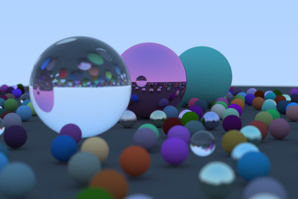

<!--
*** Thanks for checking out the Best-README-Template. If you have a suggestion
*** that would make this better, please fork the repo and create a pull request
*** or simply open an issue with the tag "enhancement".
*** Thanks again! Now go create something AMAZING! :D
***
***
***
*** To avoid retyping too much info. Do a search and replace for the following:
*** martinivnv, job-application-organiser, twitter_handle, martinivnv2002@gmail.com, JobBase, project_description
-->


<!-- PROJECT SHIELDS -->
<!--
*** I'm using markdown "reference style" links for readability.
*** Reference links are enclosed in brackets [ ] instead of parentheses ( ).
*** See the bottom of this document for the declaration of the reference variables
*** for contributors-url, forks-url, etc. This is an optional, concise syntax you may use.
*** https://www.markdownguide.org/basic-syntax/#reference-style-links
-->

<!-- PROJECT LOGO -->
<br />
<p align="center">
  <a href="https://github.com/martinivnv/ray-tracing-from-scratch">
    
  </a>

  <h3 align="center">RealLight - C++ Ray Tracer</h3>

  <p align="center">
    A ray tracer written in C++ based on Peter Shirley's Ray Tracing in One Weekend
    <br />
    <a href="https://github.com/martinivnv/ray-tracing-from-scratch"><strong>Explore the docs »</strong></a>
    <br />
    <br />
    <a href="https://github.com/martinivnv/ray-tracing-from-scratch/issues">Report Bug</a>
    ·
    <a href="https://github.com/martinivnv/ray-tracing-from-scratch/issues">Request Feature</a>
  </p>
</p>


<!-- TABLE OF CONTENTS -->
<details open="open">
  <summary><h2 style="display: inline-block">Table of Contents</h2></summary>
  <ol>
    <li>
      <a href="#renders">Renders</a>
    </li>
    <li>
      <a href="#about-the-project">About The Project</a>
    </li>
    <li>
      <a href="#getting-started">Getting Started</a>
    </li>
    <li><a href="#roadmap">Roadmap</a></li>
    <li><a href="#contributing">Contributing</a></li>
    <li><a href="#license">License</a></li>
    <li><a href="#contact">Contact</a></li>
    <li><a href="#thank-you">Contact</a></li>
  </ol>
</details>

## Renders
<p align="center">
    
</p>

<!-- ABOUT THE PROJECT -->
## About The Project
Based on Peter Shirley's Ray Tracing in One Weekend. I added the multithreading to make it render more quickly. The results of this project were quite satisfying
and I intend to expand more on this by adding more materials, custom textures, new models for objects, and so on. I learned a ton about C++, but more importantly I learned
that I have not even scratched the surface of this language.

## Getting Started

### Installation

Clone the repo
   ```sh
   git clone https://github.com/martinivnv/ray-tracing-from-scratch
   ```
Setup a local MySQL database and fill in the name and password to it in the MySQL connector in the code.

<!-- ROADMAP -->
## Roadmap

See the [open issues](https://github.com/martinivnv/ray-tracing-from-scratch/issues) for a list of proposed features (and known issues).


<!-- CONTRIBUTING -->
## Contributing

Contributions are what make the open source community such an amazing place to be learn, inspire, and create. Any contributions you make are **greatly appreciated**.

1. Fork the Project
2. Create your Feature Branch (`git checkout -b feature/AmazingFeature`)
3. Commit your Changes (`git commit -m 'Add some AmazingFeature'`)
4. Push to the Branch (`git push origin feature/AmazingFeature`)
5. Open a Pull Request


<!-- LICENSE -->
## License

Distributed under the MIT License.


<!-- CONTACT -->
## Contact

Martin Ivanov - martinivnv2002@gmail.com

Project Link: [https://github.com/martinivnv/ray-tracing-from-scratch](https://github.com/martinivnv/ray-tracing-from-scratch)

## Thank You
Enormous thanks to Peter Shirley's Ray Tracing in One Weekend book, an absolutely incredible resource!

You can find it here: [https://raytracing.github.io/books/RayTracingInOneWeekend.html](https://raytracing.github.io/books/RayTracingInOneWeekend.html)


<!-- MARKDOWN LINKS & IMAGES -->
<!-- https://www.markdownguide.org/basic-syntax/#reference-style-links -->
[contributors-shield]: https://img.shields.io/github/contributors/martinivnv/repo.svg?style=for-the-badge
[contributors-url]: https://github.com/martinivnv/repo/graphs/contributors
[forks-shield]: https://img.shields.io/github/forks/martinivnv/repo.svg?style=for-the-badge
[forks-url]: https://github.com/martinivnv/repo/network/members
[stars-shield]: https://img.shields.io/github/stars/martinivnv/repo.svg?style=for-the-badge
[stars-url]: https://github.com/martinivnv/repo/stargazers
[issues-shield]: https://img.shields.io/github/issues/martinivnv/repo.svg?style=for-the-badge
[issues-url]: https://github.com/martinivnv/repo/issues
[license-shield]: https://img.shields.io/github/license/martinivnv/repo.svg?style=for-the-badge
[license-url]: https://github.com/martinivnv/repo/blob/master/LICENSE.txt
[linkedin-shield]: https://img.shields.io/badge/-LinkedIn-black.svg?style=for-the-badge&logo=linkedin&colorB=555
[linkedin-url]: https://linkedin.com/in/martinivnv
